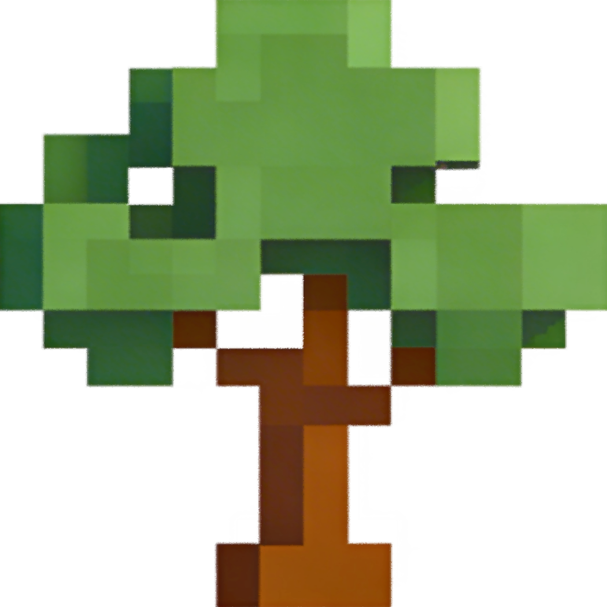

#  LAS to ENVI-met Tree Converter (las2ENVImet)


A QGIS plugin for converting LAS/LAZ point clouds of individual trees into the ENVI-met microclimate simulation model with voxel-based Leaf Area Density (LAD) and physiological A-gs parameterization.

---

## Key features

- **Point cloud input**
  - Load LAS/LAZ point clouds
  - Optional ROI selection around a single tree
  - Percentile-based Z-filtering for easy trunk selection
    
- **Tree geometry & alignment**
  - Interactive trunk point picking in the map canvas
  - Automatic calculation of tree height and crown extents
  - Scaling, rotation and translation of the point cloud to match target dimensions
  - Preview of the transformed tree directly in QGIS

- **Voxelisation & LAD**
  - Voxelisation of the tree (1 m resolution)
  - Per-voxel point counts
  - Interactive slice viewer to explore horizontal layers (Z-level) with point counts/LAD labels
  - Export-ready LAD volume consistent with ENVI-met’s file format

- **Reference-based LAD calibration**
  - Pick reference voxels directly in the map canvas
  - Assign measured LAD values to those voxels
  - Global LAD recalibration using multiple reference voxels
  - Optional trunk enhancement, crown factor scaling, LAD thresholding and ground clearing

- **Physiology (A‑gs)**
  - Species-based presets for A‑gs parameters (photosynthesis, stomatal conductance)
  - Manual override mode to edit all physiological parameters

- **ENVI-met export**
  - Plant ID and description fields for integration into ENVI-met projects
  - Export a complete tree as .txt file or automatically update your existing ENVI-met database

---

## Typical workflow

1. **Load point cloud**
   - Open QGIS and activate the plugin.
   - Load a LAS/LAZ file as a point cloud layer or select an existing point cloud layer.

2. **Define tree region and trunk**
   - Use *Select ROI* to draw a polygon around the target tree.
   - Apply Z-percentile filtering to easily identify the stem.
   - Use *Select stem* and click the trunk centre point in the map.

3. **Check and adjust geometry**
   - Inspect automatically detected height and crown widths.
   - Adjust target height, X/Y widths and rotation if needed.
   - Use *Preview scale* to visualise the transformed tree in the QGIS canvas.

4. **Generate voxels & LAD**
   - Create a 1 m voxel grid and compute point counts per voxel.
   - Use the Z-level spin box to step through horizontal slices and inspect voxel structure.

5. **Calibrate LAD with references**
   - Activate reference voxel selection and click representative voxels in the map.
   - Assign LAD values (e.g. from field measurements or literature).
   - Run global refinement to calibrate LAD across the full voxel grid.

6. **Refine and export**
   - Optionally:
     - Enhance or decrease trunk LAD along the stem axis.
     - Apply LAD scaling within a specified Z-range.
     - Clear ground voxels and apply an LAD threshold.
   - Choose species preset or enter manual A‑gs parameters.
   - Set a 6-character Plant ID, choose output path and (optionally) an ENVI-met database.
   - Export the final tree into ENVI-met. Open ENVI-met Albero to inspect your voxelized tree.

---

## Installation

### From source

1. Clone or download (.zip) this repository:
```bash
git clone https://github.com/peer-schoeneberger/las2ENVImet.git
```
2. Copy the las2envimet folder into your local QGIS plugin directory, for example:
   - Windows: %APPDATA%\Roaming\QGIS\QGIS3\profiles\default\python\plugins\
   - Linux: ~/.local/share/QGIS/QGIS3/profiles/default/python/plugins/

3. Restart QGIS and enable “LAS to ENVI-met Tree Converter” in:
Plugins → Manage and Install Plugins…

### From the QGIS plugin repository
_Available soon_


## Dependencies
The plugin requires:

- QGIS ≥ 3.10

- Python packages (in the QGIS Python environment):

  - **laspy[lazrs]**
  - numpy
  - matplotlib (optional, for faster polygon point-in tests)

If these are missing, install them into the QGIS Python environment, e.g. via the OSGeo4W shell (Windows) or the Python environment used by QGIS:


```bash
pip install laspy[lazrs] numpy matplotlib
```

You can download the latest version of QGIS [here](https://qgis.org/download/).

You can download the latest version of ENVI-met [here](https://envi-met.info/doku.php?id=files:start).

## Limitations and assumptions
- The plugin is designed for single-tree workflows, not for large forest stands.
- Voxel size is currently fixed at 1 m for ENVI-met compatibility.
- LAD calibration accuracy depends strongly on the quality and representativeness of the reference voxels.


## Use cases
- Deriving physically consistent ENVI-met trees from terrestrial or mobile LiDAR scans.
- Parameterising urban street trees with realistic LAD and A‑gs profiles.
- Performing sensitivity analyses of tree geometry vs. microclimate impact in ENVI-met.
- Building reproducible tree libraries from measured point cloud data for research and teaching.


## Contributing
Contributions, bug reports and feature requests are welcome:

- Issue tracker: https://github.com/peer-schoeneberger/las2ENVImet/issues
- Pull requests with bug fixes, documentation improvements or new features are appreciated.
- If you use this plugin in scientific work, please consider citing the repository or related publications (once available).
